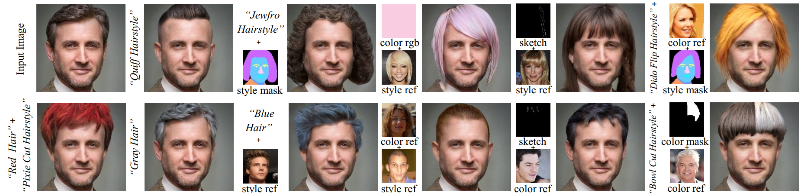

# Coiffeur - Interactive UI fork of HairClip v2

[HairCLIPv2](https://github.com/wty-ustc/HairCLIPv2)
HairCLIPv2 supports hairstyle and color editing individually or jointly with **unprecedented user interaction mode support**, including text, mask, sketch, reference image, etc.




## Getting Started
### Prerequisites
```bash
$ pip install torch==1.9.0+cu111 torchvision==0.10.0+cu111 -f https://download.pytorch.org/whl/torch_stable.html
$ pip install ftfy regex tqdm matplotlib jupyter ipykernel opencv-python scikit-image kornia==0.6.7 face-alignment==1.3.5 dlib==19.22.1
$ pip install git+https://github.com/openai/CLIP.git
```
### Pretrained Models
Download and put all the downloaded pretrained weights into the `pretrained_models` directory.
| Path | Description
| :--- | :----------
|[FFHQ StyleGAN](https://drive.google.com/file/d/1g8S81ZybmrF86OjvjLYJzx-wx83ZOiIw/view?usp=drive_link) | StyleGAN model pretrained on FFHQ with 1024x1024 output resolution.
|[Face Parse Model](https://drive.google.com/file/d/1OG6t7q4PpHOoYNdP-ipoxuqYbfMSgPta/view?usp=drive_link) | Pretrained face parse model taken from [Barbershop](https://github.com/ZPdesu/Barbershop/).
|[Face Landmark Model](https://drive.google.com/file/d/1c-SgUUQj0X1mIl-W-_2sMboI2QS7GzfK/view?usp=drive_link) | Used to align unprocessed images.
|[Bald Proxy](https://drive.google.com/file/d/1sa732uBfX1739MFsvtRCKWCN54zYyltC/view?usp=drive_link) | Bald proxy weights from [HairMapper](https://github.com/oneThousand1000/HairMapper). 
|[Sketch Proxy](https://drive.google.com/file/d/1qk0ZIfA1VmrFUzDJ0g8mK8nx0WtF-5sY/view?usp=drive_link) | Sketch proxy weights trained on [hair-sketch dataset](https://github.com/chufengxiao/SketchHairSalon#Dataset) using [E2style](https://github.com/wty-ustc/e2style).
